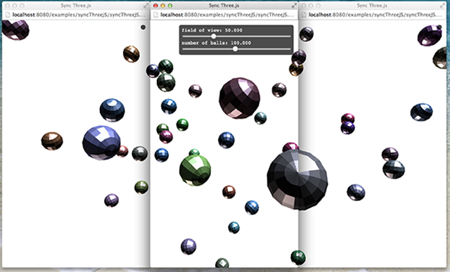

SyncThreeJS
===========

This is a demo that "happens" to use HappyFunTimes.
**It is not a game**. It's just a demo

Instead it shows using HappyFunTimes to keep multiple
machines in sync. So for example if you wanted
to make a virtual display across multiple machines
this is one technique to do it.

Choose **"Start Window Position Based"** and then move and resize the windows.

The basic premise is this:

*   open a browser window on multiple machines.

    On each machine, put settings in the url specifying where in a larger virtual display that
    particular machine is.

    For example, if you have 2 machines set next to each other each with a resolution of 1280x960.
    Machine ABC on the left and Machine DEF on the right. Together they make a virutal display
    2560x960

        +---------------++---------------+
        |               ||               |
        |               ||               |
        |  Machine ABC  ||  Machine DEF  |
        |               ||               |
        |<---- 1280 --->||<---- 1280 --->|
        +---------------++---------------+

         <------------ 2560 ------------>

    On Machine ABC you'd use URL

        http://<ipaddresofserver>/games/<id>/sync2d.html?settings={shared:{fillWidth:2560,fullHeight:960},left:0,top:0,server:true}

    On Machine DEF you'd use URL

        http://<ipaddresofserver>/games/<id>/sync2d.html?settings={shared:{fillWidth:2560,fullHeight:960},left:1280,top:0,server:false}

    The difference between those URLs is the `left` parameter and the `server` parameter.
    One machine is "the server". It controls the other machines. The `left` and `top` parameters
    tell that machine which part of the larger virtual display it represents. Each machine looks up the size
    of the window it creates to get the correct width and height.

    After that the sample uses [three.js](http://threejs.org) and sets the camera's parameters calling
    `camera.setViewOffset` that part of the scene rendered represents
    the correct part of the larger virtual canvas. All machines draw the entire scene.
    All drawing is based on a clock. Because the clock is kept in sync by HappyFunTimes
    all the machines match up on what they are trying to draw.

    As far as keeping settings in sync the machine with `server: true` displays a set of sliders.
    It sends the the updated settings to HappyFunTimes which are then propogated to all the machines.

Cloning
-------

[If you want to clone this follow the instructions here](https://github.com/greggman/HappyFunTimes/blob/master/docs/makinggames.md)

